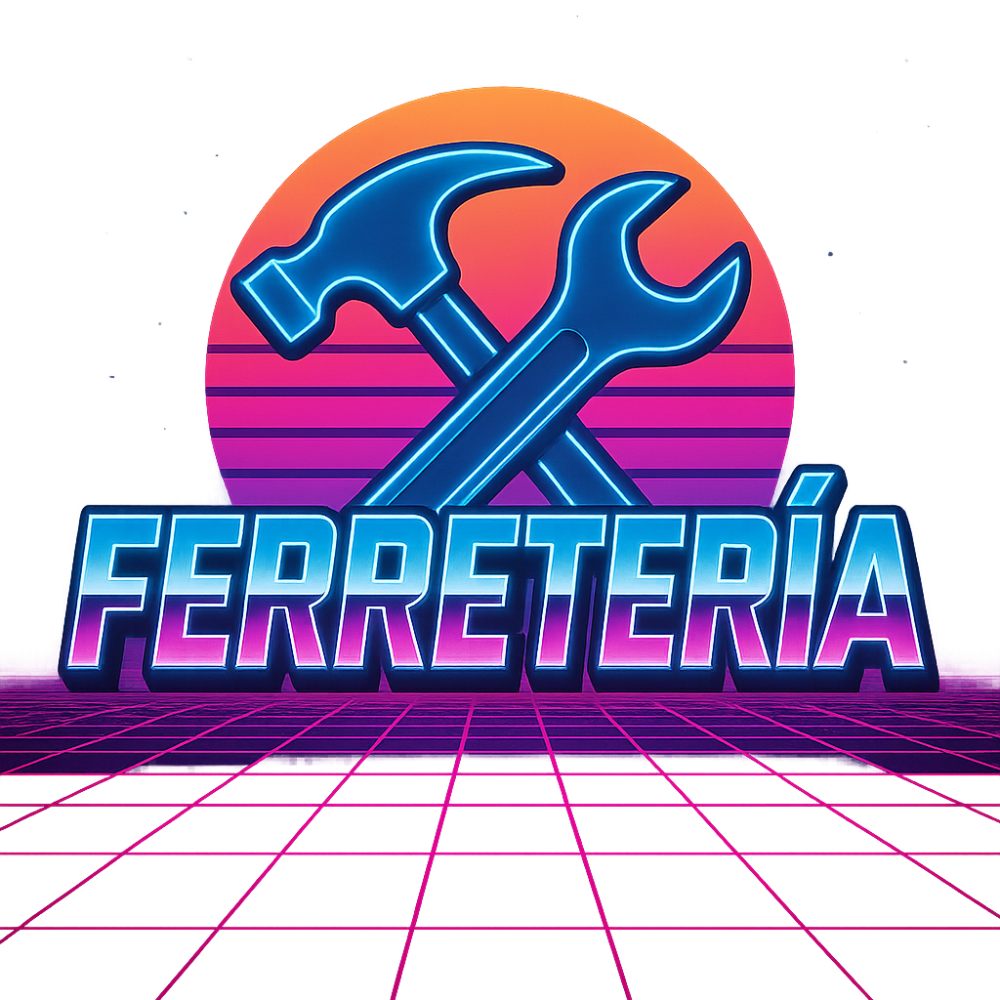
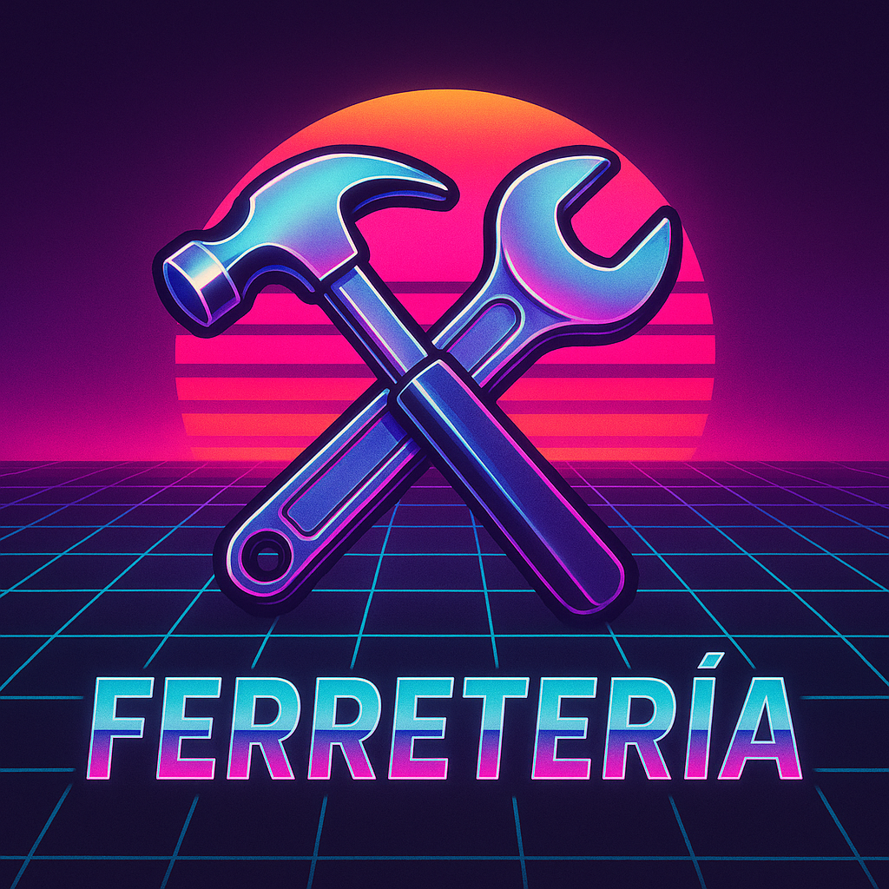

<p align="center">
	
</p>

# Ferrepoco

> **Transformando la gestión de ferreterías con tecnología, inteligencia y experiencia de usuario de primer nivel.**

---

## 🚀 Descripción General
Ferrepoco es una plataforma integral para la gestión moderna de ferreterías, diseñada para optimizar inventarios, potenciar la experiencia del cliente y ofrecer análisis estratégicos en tiempo real. Nace como respuesta a los retos de digitalización, eficiencia operativa y personalización en el sector ferretero.

---

## 🏆 Características Destacadas

- **Gestión de Usuarios y Roles:**
	- Acceso seguro para administradores, empleados y clientes.
	- Control granular de permisos y flujos personalizados por rol.
- **Inventario Inteligente:**
	- Catálogo de productos con imágenes, categorías y stock en tiempo real.
	- Alertas automáticas de bajo inventario y reportes de productos críticos.
- **Carrito y Pedidos:**
	- Carrito de compras responsivo, gestión de pedidos y seguimiento de estado.
	- Integración con pasarela de pago y generación de reportes de ventas.
- **Dashboards y Reportes:**
	- Paneles interactivos para ventas, clientes, productos y tendencias.
	- Visualización de métricas clave y exportación de datos.
- **Comunicación y Soporte:**
	- Chatbot integrado para atención al cliente y FAQs.
	- Manual de usuario y sección de preguntas frecuentes.
- **Experiencia Responsive:**
	- Interfaz adaptativa para escritorio, tablet y móvil.
	- Navegación lateral inteligente y componentes optimizados para cualquier dispositivo.
- **Impulsado por IA:**
	- Sugerencias inteligentes, análisis de patrones y soporte a decisiones estratégicas.

---

## 🏗️ Arquitectura y Tecnologías

| Capa         | Tecnología Principal | Descripción |
|--------------|---------------------|-------------|
| Frontend     | Vue.js + Vite + Tailwind CSS | SPA moderna, componentes reutilizables, diseño responsivo y rápido. |
| Backend      | Node.js + Express   | API RESTful, lógica de negocio, autenticación y control de acceso. |
| Base de Datos| JSON (demo) / SQL (extensible) | Persistencia de usuarios, productos, pedidos y reportes. |
| IA           | Gemini API / OpenAI (opcional) | Chatbot, análisis de datos y generación de insights. |

---

## 📁 Estructura del Proyecto

```
Ferrepoco/
├── backend/         # Servidor Node.js, rutas, lógica y persistencia
│   ├── routes/      # Endpoints REST (auth, productos, pedidos, reportes...)
│   ├── src/         # DB, middlewares, utilidades
│   └── scripts/     # Scripts de inicialización y utilidades
├── frontend/        # SPA Vue.js, componentes, vistas y assets
│   ├── src/
│   │   ├── components/  # Componentes UI y layouts
│   │   ├── views/       # Vistas principales (Dashboards, Auth, FAQs...)
│   │   ├── stores/      # Pinia stores (auth, carrito...)
│   │   ├── services/    # API y servicios externos
│   │   └── router/      # Rutas de la aplicación
│   └── public/      # Assets estáticos
└── README.md        # Este archivo
```

---

## 🔥 Flujos Principales de Usuario

### 👤 Autenticación y Roles
- Registro y login seguro para clientes, empleados y administradores.
- Recuperación y restablecimiento de contraseña.
- Paneles personalizados según el rol.

### 🛒 Gestión de Productos y Carrito
- Búsqueda avanzada y filtrado de productos.
- Carrito responsivo con edición de cantidades y eliminación de ítems.
- Proceso de compra guiado y confirmación de pedido.

### 📦 Administración de Inventario
- Alta, baja y modificación de productos.
- Visualización de stock, alertas y reportes de inventario.
- Gestión de categorías y carga masiva de imágenes.

### 📊 Dashboards y Reportes
- Paneles con métricas de ventas, clientes y productos más vendidos.
- Exportación de reportes y visualización de tendencias.

### 🤖 Chatbot y Soporte
- Chatbot Gemini para atención automática y FAQs.
- Manual de usuario y sección de términos y condiciones.

---

## 📱 Responsividad y Experiencia de Usuario
- **Diseño mobile-first:** Grids y layouts adaptativos, navegación lateral oculta en móvil, botones grandes y accesibles.
- **Componentes optimizados:** Carrito, formularios, tablas y dashboards con scroll y truncado inteligente.
- **Animaciones suaves:** Transiciones y overlays para modales y paneles.
- **Accesibilidad:** Contrastes altos, etiquetas ARIA y navegación por teclado.

---

## 🤖 Inteligencia Artificial Integrada
- **Chatbot Gemini:** Responde preguntas frecuentes, guía al usuario y asiste en procesos de compra.
- **Análisis de datos:** Sugerencias de productos, alertas inteligentes y reportes automáticos.
- **Soporte a decisiones:** Recomendaciones para reabastecimiento y promociones.

---

## ⚙️ Instalación y Puesta en Marcha

### Requisitos
- Node.js >= 18.x
- npm >= 9.x

### Backend
```bash
cd backend
npm install
npm start
```

### Frontend
```bash
cd frontend
npm install
npm run dev
```

La app estará disponible en `http://localhost:5173` (por defecto).

---

## 🧩 Contribución

¡Ferrepoco es un proyecto abierto a la comunidad! Para contribuir:
1. Haz un fork del repositorio.
2. Crea una rama con tu mejora: `git checkout -b feature/mi-mejora`
3. Realiza tus cambios y haz commit.
4. Envía un Pull Request detallando tu aporte.

**Recomendaciones:**
- Sigue la convención de nombres y estilos del proyecto.
- Añade documentación y comentarios claros.
- Si tu cambio afecta la UI, adjunta capturas de pantalla.

---

## 📝 Créditos y Licencia

Desarrollado por el equipo de Ferrepoco con apoyo de IA generativa.

Licencia MIT. Eres libre de usar, modificar y compartir este proyecto.

---

## 📚 Más Información
- [backend/README.md](backend/README.md)
- [frontend/README.md](frontend/README.md)

<p align="center">
	
</p>
